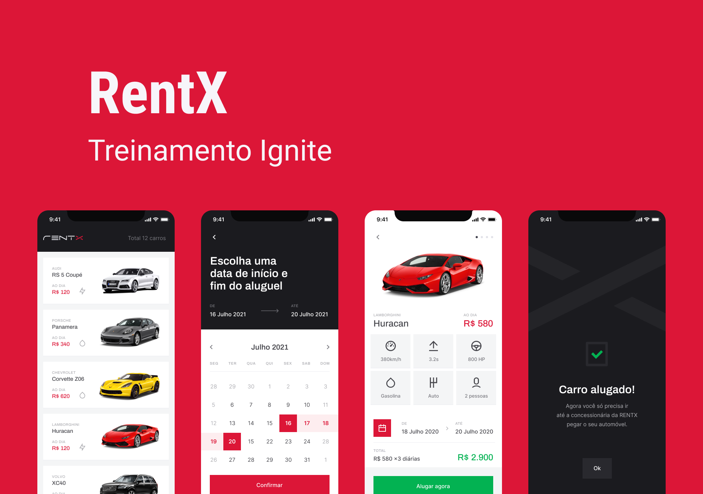

  

<h1 align="center">
  
</h1>

## 📌 Sobre
  RentX é um aplicativo para locação de carros.
  
  Aplicação desenvolvida durante o curso Ignite da trilha React Native.

## ⚒  Tecnologias e Funcionalidades
- [x] Expo Go;
- [x] React;
- [x] React Native;
- [x] React Navigation;
- [x] Hooks;
- [x] Lottie;
- [x] Axios;
- [x] Animações na tela Splash, ScrollView;
- [x] Animações com Lottie;
- [x] Criar calendário e trabalhar com intervalos de datas;
- [x] Criar a tela Splash;
- [x] Consumo de API;
- [x] Navegação entre telas (stack navigator);
- [x] Criar um menu flutuante na tela Home;

## Layout da aplicação
O Layout da aplicação está no [figma](https://www.figma.com/file/TkiGiIs79fUOVjbOKxLCx5/RentX-Ignite).

